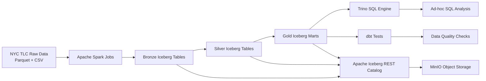
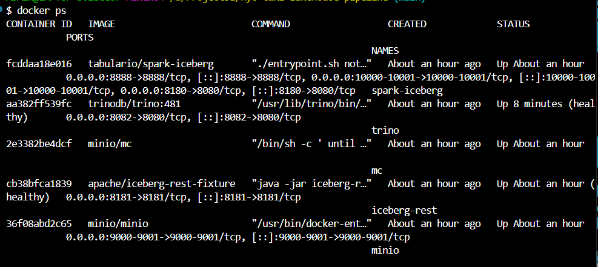
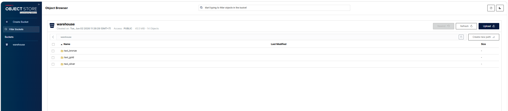
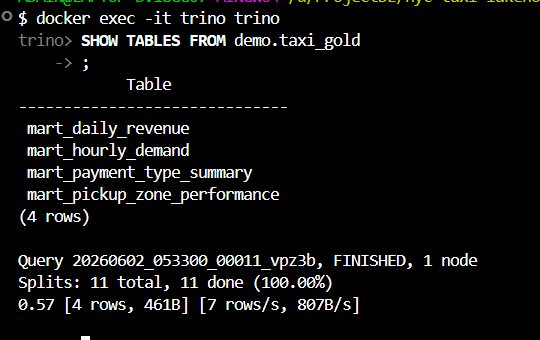
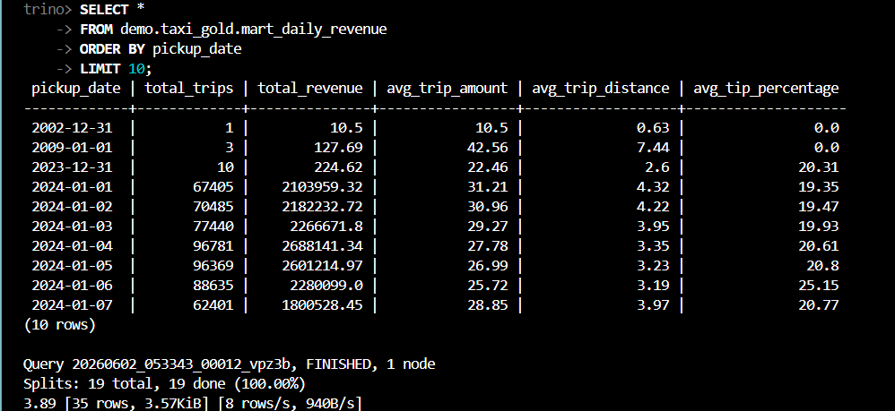
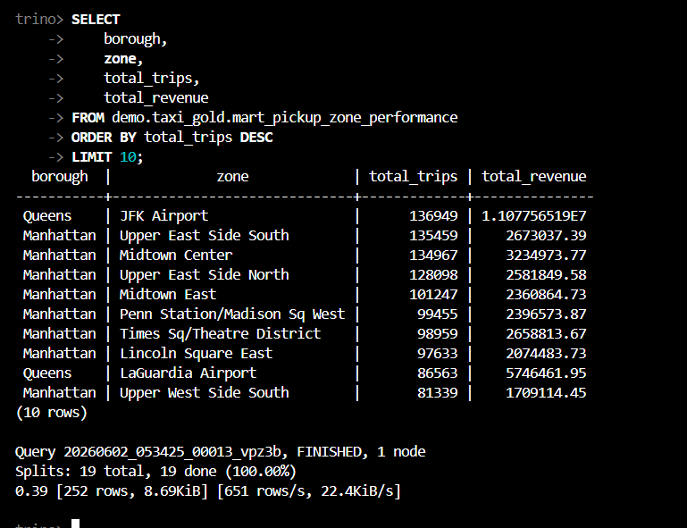
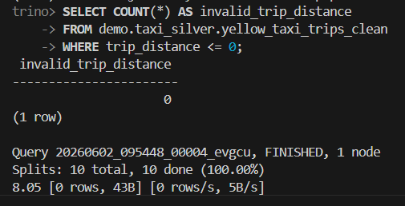
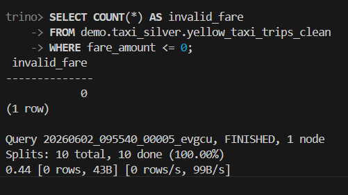
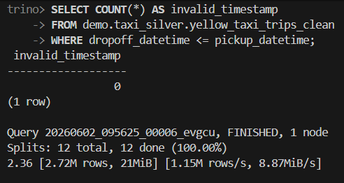
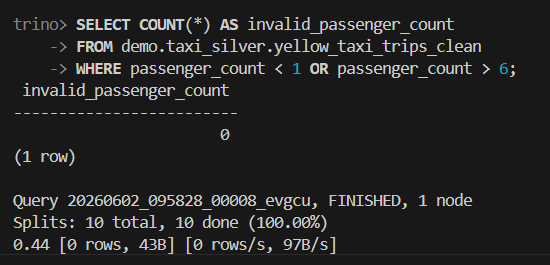

# NYC Taxi Lakehouse Pipeline


A local end-to-end lakehouse pipeline for NYC Yellow Taxi data. The project uses Spark to ingest and transform raw taxi data into Apache Iceberg tables, stores the lakehouse data in MinIO, exposes the tables through Trino, and validates the final datasets with dbt tests.

## Overview

This repository demonstrates a compact data engineering workflow using the Bronze, Silver, and Gold data modeling pattern.

- **Bronze**: raw NYC Yellow Taxi trip data ingested from Parquet into Iceberg.
- **Silver**: cleaned and standardized taxi trips with derived fields such as pickup date, pickup hour, trip duration, fare per mile, and tip percentage.
- **Gold**: analytics-ready marts for revenue, hourly demand, pickup zone performance, and payment type analysis.

The pipeline is designed to run locally with Docker Compose and open-source lakehouse tools.

## Architecture



## Tech Stack

| Tool | Purpose |
| --- | --- |
| Python | Spark job implementation |
| Apache Spark | Batch ingestion, cleaning, and mart creation |
| Apache Iceberg | Lakehouse table format |
| Iceberg REST Catalog | Table catalog service for Spark and Trino |
| MinIO | Local S3-compatible object storage |
| Trino | SQL query engine for Iceberg tables |
| dbt + dbt-trino | Source tests and custom data quality checks |
| Docker Compose | Local infrastructure orchestration |

## Project Structure

```text
.
|-- data/
|   `-- raw/
|       |-- taxi_zone_lookup.csv
|       `-- yellow_tripdata_2024-01.parquet
|-- dbt_taxi/
|   |-- dbt_project.yml
|   |-- profiles.yml
|   |-- models/
|   |   `-- sources.yml
|   `-- tests/
|       |-- assert_no_invalid_fare.sql
|       |-- assert_no_invalid_passenger_count.sql
|       |-- assert_no_invalid_timestamp.sql
|       `-- assert_no_invalid_trip_distance.sql
|-- docs/
|   `-- dashboard_screenshots/
|-- spark/
|   |-- jobs/
|   |   |-- 00_load_zone.py
|   |   |-- 01_bronze_ingest.py
|   |   |-- 02_silver_clean.py
|   |   `-- 03_gold_marts.py
|   `-- utils/
|       `-- spark_session.py
|-- trino/
|   `-- catalog/
|       `-- demo.properties
|-- warehouse/
|-- docker-compose.yml
|-- .env.example
`-- README.md
```

## Data Source

The pipeline uses local raw files stored under `data/raw`:

- `yellow_tripdata_2024-01.parquet`: NYC Yellow Taxi trip records.
- `taxi_zone_lookup.csv`: taxi zone reference data.

The Spark jobs read these files from the project volume mounted into the Spark container.

## Data Pipeline

### 1. Load Taxi Zones

`spark/jobs/00_load_zone.py`

Creates the `taxi_silver.taxi_zones` Iceberg table from `taxi_zone_lookup.csv`.

### 2. Bronze Ingestion

`spark/jobs/01_bronze_ingest.py`

Reads the raw Yellow Taxi Parquet file and writes it to `taxi_bronze.yellow_taxi_trips`, adding:

- `source_file`
- `ingestion_timestamp`

### 3. Silver Cleaning

`spark/jobs/02_silver_clean.py`

Creates `taxi_silver.yellow_taxi_trips_clean` by:

- standardizing column names
- removing invalid timestamps
- removing zero or negative trip distance
- removing invalid fare and total amount records
- filtering passenger count to a valid range
- deriving pickup date, pickup hour, day of week, trip duration, fare per mile, and tip percentage

### 4. Gold Marts

`spark/jobs/03_gold_marts.py`

Creates analytics-ready tables in the `taxi_gold` schema:

- `mart_daily_revenue`
- `mart_hourly_demand`
- `mart_pickup_zone_performance`
- `mart_payment_type_summary`

## Getting Started

### Prerequisites

- Docker and Docker Compose
- Python environment with `dbt-trino` installed, if you want to run dbt from the host machine

### Environment Setup

Copy the example environment file:

```bash
cp .env.example .env
```

The default local services are configured through `.env`:

```env
MINIO_ENDPOINT=http://minio:9000
MINIO_BUCKET=warehouse
ICEBERG_REST_URI=http://rest:8181
ICEBERG_WAREHOUSE=s3://warehouse/
ICEBERG_CATALOG=demo
TRINO_PORT=8082
TRINO_USER=admin
```

Update credentials if needed, then start the local stack:

```bash
docker compose up -d
```

Main service URLs:

- MinIO Console: <http://localhost:9001>
- Trino: <http://localhost:8082>
- Spark notebook/service port: <http://localhost:8888>
- Iceberg REST Catalog: <http://localhost:8181>

## Run the Pipeline

Run each Spark job inside the `spark-iceberg` container:

```bash
docker exec -it spark-iceberg bash -lc "cd /home/iceberg/project && spark-submit spark/jobs/00_load_zone.py"
docker exec -it spark-iceberg bash -lc "cd /home/iceberg/project && spark-submit spark/jobs/01_bronze_ingest.py"
docker exec -it spark-iceberg bash -lc "cd /home/iceberg/project && spark-submit spark/jobs/02_silver_clean.py"
docker exec -it spark-iceberg bash -lc "cd /home/iceberg/project && spark-submit spark/jobs/03_gold_marts.py"
```

After the jobs complete, the Iceberg tables should be available in the `demo` catalog through Trino.

## Query with Trino

Open the Trino CLI or connect with any SQL client using:

- Host: `localhost`
- Port: `8082`
- Catalog: `demo`
- User: `admin`

Example queries:

```sql
SHOW SCHEMAS FROM demo;
SHOW TABLES FROM demo.taxi_gold;

SELECT *
FROM demo.taxi_gold.mart_daily_revenue
ORDER BY pickup_date;

SELECT borough, zone, total_trips, total_revenue
FROM demo.taxi_gold.mart_pickup_zone_performance
ORDER BY total_trips DESC
LIMIT 10;
```

## Run dbt Tests

The dbt project is located in `dbt_taxi` and uses Trino as the adapter.

```bash
cd dbt_taxi
dbt test --profiles-dir .
```

The tests include:

- not-null checks for Bronze, Silver, and Gold source columns
- uniqueness checks for selected dimension and mart keys
- custom assertions for invalid timestamps, fares, passenger counts, and trip distances

## Screenshots

### Docker Services



### MinIO Bucket



### Trino Gold Tables



### Query Results





### Data Quality Checks









## Key Learning Outcomes

- Build a local lakehouse stack with Spark, Iceberg, MinIO, and Trino.
- Use the Bronze, Silver, and Gold pattern for analytical data modeling.
- Write Spark batch jobs for ingestion, cleaning, enrichment, and mart generation.
- Query Iceberg tables through Trino.
- Validate lakehouse tables with dbt source tests and custom SQL tests.
- Organize a portfolio-ready data engineering project with reproducible local infrastructure.

## Limitations

- The pipeline currently processes one monthly Yellow Taxi Parquet file.
- Jobs are run manually from the Spark container.
- The project does not include an orchestration layer such as Airflow.
- The Trino catalog credentials are configured for local development only.

## Future Improvements

- Add Airflow orchestration for scheduled pipeline runs.
- Support multiple months or years of taxi data.
- Add incremental Iceberg writes instead of replacing tables on each run.
- Add dbt models for Gold transformations.
- Add a BI dashboard layer on top of Trino.
- Add CI checks for SQL tests and Python formatting.
